loading library, 'dplyr' for data manipulation and 'ggplot2' for data
visualization

    library(dplyr)

    ## 
    ## Attaching package: 'dplyr'

    ## The following objects are masked from 'package:stats':
    ## 
    ##     filter, lag

    ## The following objects are masked from 'package:base':
    ## 
    ##     intersect, setdiff, setequal, union

    library(ggplot2)

loading the data from the dataset file in csv format

    wage <- read.csv("Wage.csv", stringsAsFactors = FALSE)
    #stringsAsFactors is set false to avoud crating factors if value is string
    #write.csv(wage , "Wage.csv") to write data into a csv file
    #wage

the unnecessary index column is removed

    wage<- select(wage , -X)
    #wage

other files like spss , excel and json can be loaded which need
'foreign', 'readxl' and 'rjson' respectively

    dim(wage) #dimensions of data

    ## [1] 3000   11

    cat("No. of rows:" , nrow(wage)) #concatenating the string with number of rows

    ## No. of rows: 3000

    cat("\nNo. of column:", ncol(wage))

    ## 
    ## No. of column: 11

    names(wage)

    ##  [1] "year"       "age"        "maritl"     "race"       "education" 
    ##  [6] "region"     "jobclass"   "health"     "health_ins" "logwage"   
    ## [11] "wage"

    colnames(wage)#both of these show the name of header of columns

    ##  [1] "year"       "age"        "maritl"     "race"       "education" 
    ##  [6] "region"     "jobclass"   "health"     "health_ins" "logwage"   
    ## [11] "wage"

    #row.names(wage) would give name of row if there were. 

    head(wage)#shows first data

    ##   year age        maritl  race    education             region    jobclass
    ## 1 2006  18 Never Married White    < HS Grad 2. Middle Atlantic  Industrial
    ## 2 2004  24 Never Married White College Grad 2. Middle Atlantic Information
    ## 3 2003  45       Married White Some College 2. Middle Atlantic  Industrial
    ## 4 2003  43       Married Asian College Grad 2. Middle Atlantic Information
    ## 5 2005  50      Divorced White      HS Grad 2. Middle Atlantic Information
    ## 6 2008  42       Married White College Grad 2. Middle Atlantic Information
    ##        health health_ins  logwage      wage
    ## 1      <=Good      2. No 4.318063  75.04315
    ## 2 >=Very Good      2. No 4.255273  70.47602
    ## 3      <=Good     1. Yes 4.875061 130.98218
    ## 4 >=Very Good     1. Yes 5.041393 154.68529
    ## 5      <=Good     1. Yes 4.318063  75.04315
    ## 6 >=Very Good     1. Yes 4.845098 127.11574

    tail(wage, 3)#second parameter specifies the number of examples to be displayed

    ##      year age        maritl  race    education             region
    ## 2998 2005  42       Married Black    < HS Grad 2. Middle Atlantic
    ## 2999 2005  27 Never Married White Some College 2. Middle Atlantic
    ## 3000 2009  55     Separated White      HS Grad 2. Middle Atlantic
    ##        jobclass      health health_ins  logwage     wage
    ## 2998 Industrial      <=Good      2. No 4.193125 66.22941
    ## 2999 Industrial >=Very Good     1. Yes 4.477121 87.98103
    ## 3000 Industrial      <=Good     1. Yes 4.505150 90.48191

To show the whole dataset in a new tab

    View(wage)

To count the factor values:

    table(wage$education)#table function counts the factor values

    ## 
    ##          < HS Grad 5. Advanced Degree       College Grad 
    ##                268                424                684 
    ##            HS Grad       Some College 
    ##                967                646

To change the name of values, to make name of values more uniform

    wage$education[wage$education=="5. Advanced Degree"] <- "Advanced Degree"

is.na means not available values, so we can clean and remove missing and
unwanted data.

    sum(is.na(wage))

    ## [1] 55

Here 55 means there are 55 cells in which data is missing.

    table(is.na(wage))

    ## 
    ## FALSE  TRUE 
    ## 32945    55

Colsums() sums the value along the column

    colSums(is.na(wage))

    ##       year        age     maritl       race  education     region 
    ##          0          0          0          0         11         15 
    ##   jobclass     health health_ins    logwage       wage 
    ##          0          0         10          0         19

Here, health\_ins and education are qualitative data and we will impute
NA with mode value

    wage$education[is.na(wage$education)]<- names(table(wage$education))[table(wage$education) == max(table(wage$education))]
    wage$health_ins[is.na(wage$health_ins)] <- names(table(wage$health_ins))[table(wage$health_ins) == max(table(wage$health_ins))]

wage is quantitative data, so we will replace NA with median value of
the wage

    wage$wage[is.na(wage$wage)]<- median(wage$wage , na.rm = TRUE)

since the whole data was taken from Mid- atlantic region , we can remove
it from the data frame.

    wage<- select(wage, -region)

    colSums(is.na(wage))

    ##       year        age     maritl       race  education   jobclass 
    ##          0          0          0          0          0          0 
    ##     health health_ins    logwage       wage 
    ##          0          0          0          0

To replace the factor value health\_ins , which has 1 or 2

    wage$health_ins[wage$health_ins == "2. No"] <- "NO"
    wage$health_ins[wage$health_ins == "1. Yes"] <- "Yes"

<h2>
Analysis
</h2>
    max(wage$wage) #gives maximum value 

    ## [1] 318.3424

    min(wage$age) #gives minimum value

    ## [1] 18

    length(wage$year) #gives length of the vector

    ## [1] 3000

    mean(wage$wage) #gives mean

    ## [1] 111.5287

    median(wage$age) #gives median 

    ## [1] 42

    names(table(wage$race))[table(wage$race) == max(table(wage$race))] # gives mode

    ## [1] "White"

    range(wage$wage) #gives range, i.e- maximum and minimum value

    ## [1]  20.08554 318.34243

    quantile(wage$age , c(0.0 , 0.25 , 0.50 , 0.75, 1)) #gives quantiles or quartiles

    ##   0%  25%  50%  75% 100% 
    ##   18   34   42   50   80

    var(wage$wage)# gives variance

    ## [1] 1729.491

    sd(wage$wage)# gives standard deviation

    ## [1] 41.58715

Or we can use summary() function to show various statistical
calculations on dataset

    summary(wage)

    ##       year           age           maritl              race          
    ##  Min.   :2003   Min.   :18.00   Length:3000        Length:3000       
    ##  1st Qu.:2004   1st Qu.:34.00   Class :character   Class :character  
    ##  Median :2006   Median :42.00   Mode  :character   Mode  :character  
    ##  Mean   :2006   Mean   :42.38                                        
    ##  3rd Qu.:2008   3rd Qu.:50.00                                        
    ##  Max.   :2009   Max.   :80.00                                        
    ##   education           jobclass            health         
    ##  Length:3000        Length:3000        Length:3000       
    ##  Class :character   Class :character   Class :character  
    ##  Mode  :character   Mode  :character   Mode  :character  
    ##                                                          
    ##                                                          
    ##                                                          
    ##   health_ins           logwage           wage       
    ##  Length:3000        Min.   :3.000   Min.   : 20.09  
    ##  Class :character   1st Qu.:4.447   1st Qu.: 85.38  
    ##  Mode  :character   Median :4.653   Median :104.92  
    ##                     Mean   :4.655   Mean   :111.53  
    ##                     3rd Qu.:4.857   3rd Qu.:128.68  
    ##                     Max.   :5.763   Max.   :318.34

str() function displays the internal structure of an R object

    str(wage)

    ## 'data.frame':    3000 obs. of  10 variables:
    ##  $ year      : int  2006 2004 2003 2003 2005 2008 2009 2008 2006 2004 ...
    ##  $ age       : int  18 24 45 43 50 42 44 30 41 52 ...
    ##  $ maritl    : chr  "Never Married" "Never Married" "Married" "Married" ...
    ##  $ race      : chr  "White" "White" "White" "Asian" ...
    ##  $ education : chr  "< HS Grad" "College Grad" "Some College" "College Grad" ...
    ##  $ jobclass  : chr  "Industrial" "Information" "Industrial" "Information" ...
    ##  $ health    : chr  "<=Good" ">=Very Good" "<=Good" ">=Very Good" ...
    ##  $ health_ins: chr  "NO" "NO" "Yes" "Yes" ...
    ##  $ logwage   : num  4.32 4.26 4.88 5.04 4.32 ...
    ##  $ wage      : num  75 70.5 131 154.7 75 ...

Relation between variables:

    #correlation to show how strongly pair of variables (quantitative) are related.
    cor(wage%>% select(age,logwage,wage))

    ##               age   logwage      wage
    ## age     1.0000000 0.2140623 0.1960569
    ## logwage 0.2140623 1.0000000 0.9448977
    ## wage    0.1960569 0.9448977 1.0000000

correlation function can not be used on qualitative variables. We use
chi square test for this purpose

    #Hypothesis testing
    chisq.test(table(wage$jobclass,wage$education))

    ## 
    ##  Pearson's Chi-squared test
    ## 
    ## data:  table(wage$jobclass, wage$education)
    ## X-squared = 283.14, df = 4, p-value < 2.2e-16

The p-value is less than the cut off value i.e 0.05. We will reject the
null hypothesis and accept alternate hypothesis. That means jobclass and
education are related.

<h2>
Exploratory analysis
</h2>
    g<- ggplot(data = wage , aes(wage))
    g+geom_density()

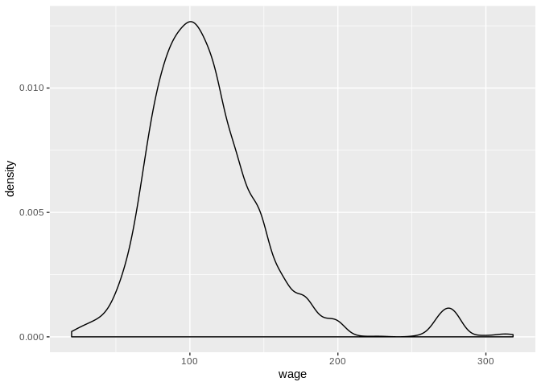

    #this code generates normal distribution
    library(moments)
    normal<-as.data.frame(rnorm(500))
    names(normal)<- c("Norm")
    ggplot(normal)+geom_density(aes(Norm))

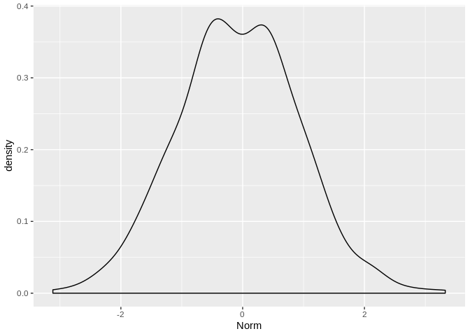

    skewness(normal)

    ##       Norm 
    ## 0.05783681

    g<- ggplot(data = wage , aes(age))
    g+geom_histogram()

    ## `stat_bin()` using `bins = 30`. Pick better value with `binwidth`.

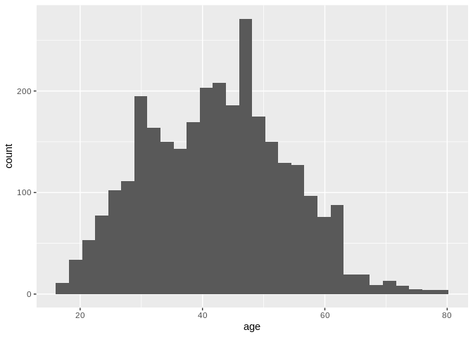

    skewness(wage$age)

    ## [1] 0.1480543

    kurtosis(wage$age)

    ## [1] 2.571931

The skewness value of age shows that age is Positively skewed
distribution or right skewed and the kurtosis values tells that its
Leptokurtic distribution.

<h3>
Bar plots
</h3>
    ggplot(as.data.frame(table(wage$race)),aes(Var1,Freq)) +geom_col(aes(fill=Var1))

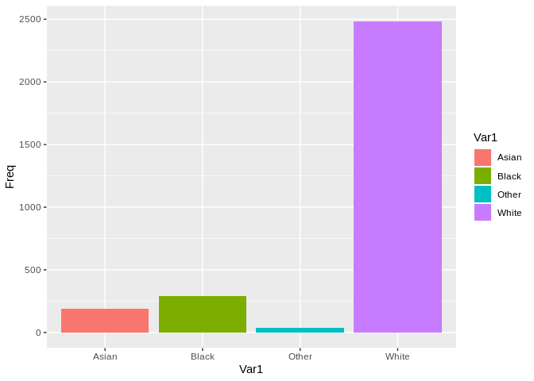

<h4>
Lineplot
</h4>
    ggplot(as.data.frame(table(wage$age),stringsAsFactors = FALSE) ,aes(Var1,Freq)) +geom_point()+geom_line(aes(group=1))+scale_x_discrete(breaks = c(18,28,38,48,58,68,80))

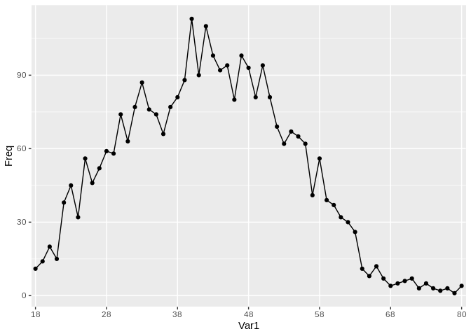

<h3>
Boxplot
</h3>
To show the quantiles and outliers in a single plot.

    boxplot(wage%>% select(age,wage))

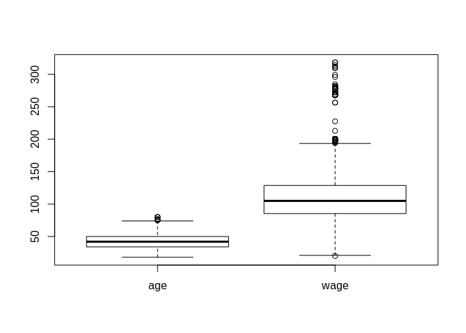

<h2>
Visualizations
</h2>
    maritl<- as.data.frame(table(wage$maritl,wage$age), stringsAsFactors = FALSE)%>% group_by(Var1)

    g<- ggplot(maritl,aes(Var2,Freq))+geom_line(aes(group=Var1,color=Var1))
    g + theme(axis.text.x = element_text(angle = 90 , hjust = 1))

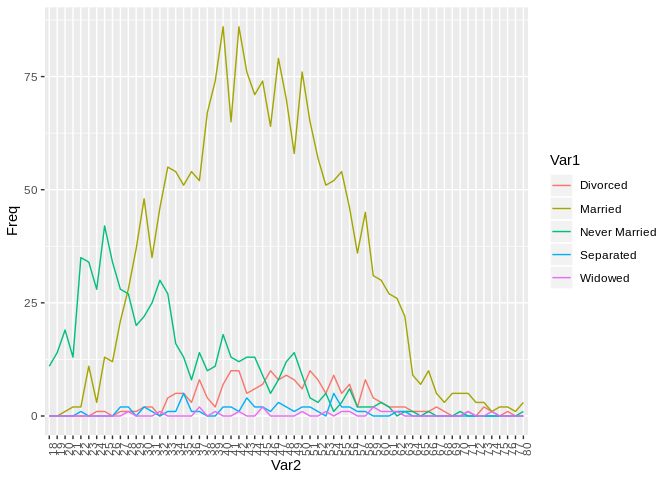

    g<- g+scale_x_discrete(breaks = c(18,28,38,48,58,68,80))+ggtitle("Marital status and the age of the worker") +xlab("Age") + ylab("Count")
    g+scale_color_discrete(name="Marital Status")

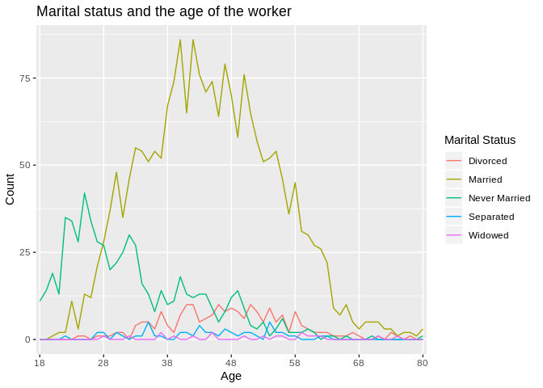
This lineplot shows the maritial status of the workers with colour and
count of worker with differnt age .

    ggplot(as.data.frame(table(wage$year)), aes(Var1,Freq)) + geom_col() + ggtitle("Count of the people in survey over the year")+xlab("Years") +ylab("Count")

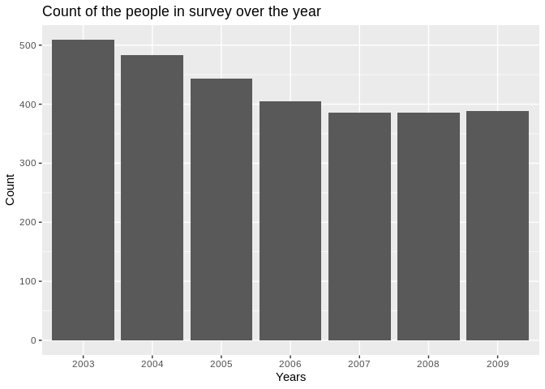
This barplot shows the number of data collected over the year.Maximum
data was collected in year 2003.

    race <- as_tibble(table(wage$race))

Tibble is modern and efficient version of the old dataframe.

    head(race,3)

    ## # A tibble: 3 x 2
    ##   Var1      n
    ##   <chr> <int>
    ## 1 Asian   189
    ## 2 Black   291
    ## 3 Other    37

    names(race) <- c("Race" , "Count")
    names(race)

    ## [1] "Race"  "Count"

    g<- ggplot(race , aes(Race, Count))
    g+geom_col(aes(fill = Race)) +labs(title = "Workers count on the basis of race")+ theme(legend.position = "")+ geom_text(aes(Race , Count , label=Count))

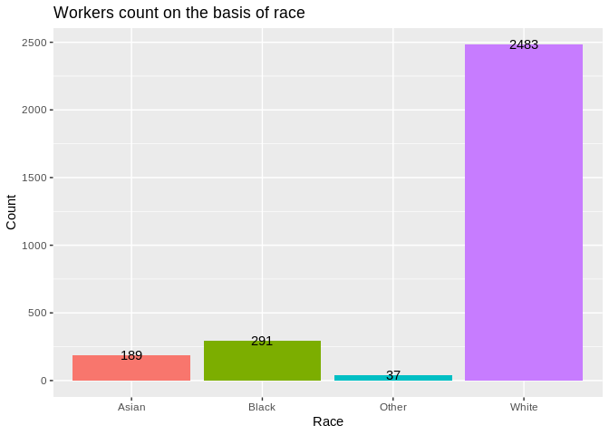
This plots shows the data has more white race workers in worksforce.

    edu <- as_tibble(table(wage$education))
    names(edu) <- c("Education" ,"Count")
    g<- ggplot(edu , aes(Education, Count))
    g+geom_col(aes(fill = Education)) +ggtitle("Count off Workers on basis of Education") + theme(legend.position = "") +geom_text(aes(Education,Count,label=Count))

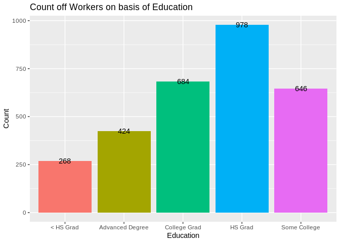
This barplot shows that maximum number of workers are with HS grad.

    table(wage$education)

    ## 
    ##       < HS Grad Advanced Degree    College Grad         HS Grad 
    ##             268             424             684             978 
    ##    Some College 
    ##             646

    health_age<-as_tibble(table(wage$age,wage$health_ins))
    names(health_age)<- c("Age","Health_insurance","Count")
    names(health_age)

    ## [1] "Age"              "Health_insurance" "Count"

In the plot below we are ploting the count of workers on basis of Age
and Health Insurance.

    g<- ggplot(health_age,aes(Age,Count))
    g+geom_line(aes(group=Health_insurance,color=Health_insurance))+geom_point(aes(color=Health_insurance))+scale_x_discrete(breaks=c(18,28,38,48,58,68,80))

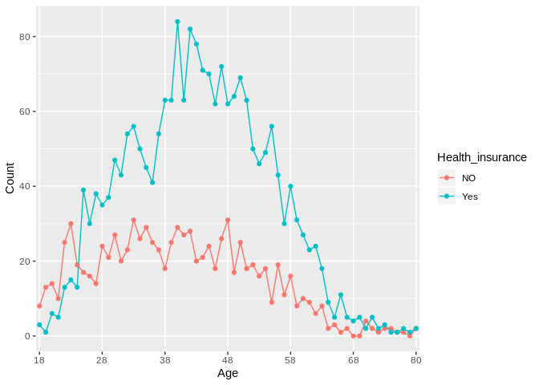
We can see that less number of worker with age 18 to 24 has health
insurance.The people from 38 to 48 has maximum number of health
insurance .

    ggplot(wage,aes(age)) +geom_density()

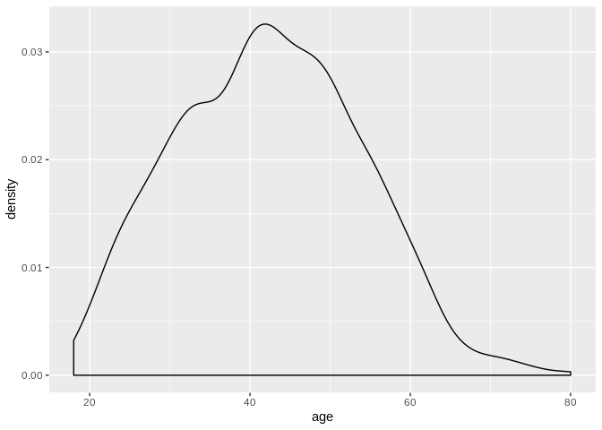
This density plot shows that the maximum number of workers are from 38
to 48 group .

    indus_edu_hea <- as_tibble(table(wage$jobclass,wage$education,wage$health))
    names(indus_edu_hea) <- c("Job","Education" , "Health" , "Count")

    g<- ggplot(indus_edu_hea , aes(Education, Count))
    g+geom_col(aes(fill = Education)) +facet_grid(.~Health)+theme(axis.text.x = element_blank()) +labs(title = "Health Conditions and Education of workers")

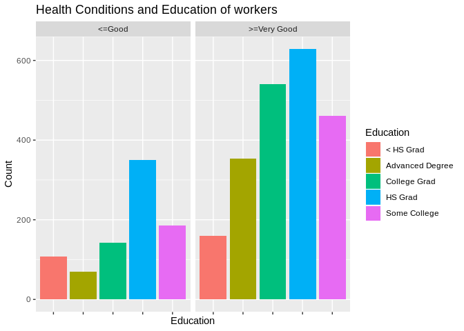
This barplot shows multiple type of data in single plot.This barplot is
divided into two group on basis of health of workers and the color
define the colors.

    g<- ggplot(indus_edu_hea, aes(Education, Count))
    g+geom_col(aes(fill=Education)) +facet_grid(.~Job) +theme(axis.text.x = element_blank())+labs(title = "Education and the Job worker.")

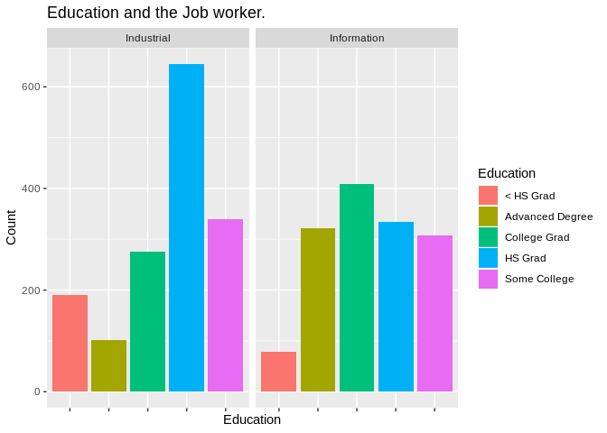
This plot shows that the lots of worker with HS grad are working in
industry.
